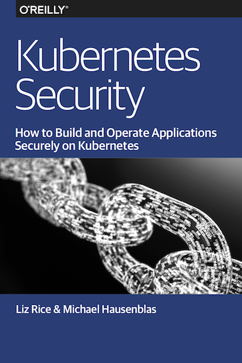

Hello and welcome to Kubernetes Security, the resource center for the [O'Reilly book](https://info.aquasec.com/kubernetes-security) on this topic by Liz Rice and Michael Hausenblas.

In the book we explore security concepts including defense in depth, least privilege, and limiting the attack surface. We discuss and show how to secure clusters, and you'll also learn how Kubernetes uses authentication and authorization. The book will teache you how to secure container images against known vulnerabilities and abuse by third parties, enforce policies on the container runtime level as well as the networking level, and give you to rundown on how to handle sensitive information such as credentials. 

### Table of contents

- [Securing the cluster](#securing-the-cluster)
- [Authentication and authorization](#authentication-and-authorization)
- [Securing your container images](#securing-your-container-images)
- [Running containers securely](#running-containers-securely)
- [Secrets management](#secrets-management)
- [Advanced topics](#advanced-topics)
- [References](#references)

---

## Securing the cluster

Relevant pages in the official Kubernetes documentation:

- [Securing a Cluster](https://kubernetes.io/docs/tasks/administer-cluster/securing-a-cluster/)
- [Encrypting Secret Data at Rest](https://kubernetes.io/docs/tasks/administer-cluster/encrypt-data/)
- [Installation—Recommended setup](https://github.com/kubernetes/dashboard/wiki/Installation#recommended-setup)
- [Auditing](https://kubernetes.io/docs/tasks/debug-application-cluster/audit/)
- [Certificate Rotation](https://kubernetes.io/docs/tasks/tls/certificate-rotation/)

Further reading:

- [CVE-2018-1002105—Kubernetes privilege escalation and access to sensitive information](https://www.theregister.co.uk/2018/12/03/kubernetes_flaw_cve_2018_1002105/)
- etcd's [transport security model](https://github.com/etcd-io/etcd/blob/master/Documentation/op-guide/security.md)
- [Securing Kubernetes components: kubelet, etcd and Docker registry](https://sysdig.com/blog/kubernetes-security-kubelet-etcd/) 
- [K8s security best practices](https://www.slideshare.net/SharonVendrov/k8s-security-best-practices-85961183) 
- [Kubernetes Security - Best Practice Guide](https://github.com/freach/kubernetes-security-best-practice) 
- [Lessons from the Cryptojacking Attack at Tesla](https://blog.redlock.io/cryptojacking-tesla) 
- [Hacking and Hardening Kubernetes Clusters by Example](https://www.youtube.com/watch?v=vTgQLzeBfRU) 
- [What Does “Production Ready” Really Mean for a Kubernetes Cluster](https://weave.works/blog/what-does-production-ready-really-mean-for-a-kubernetes-cluster)
- [A Hacker's Guide to Kubernetes and the Cloud](https://www.youtube.com/watch?v=dxKpCO2dAy8)
- [Kubernetes Container Clustering, Catastrophe](https://www.youtube.com/watch?v=b3qJwIttqqs)
- [Hardening Kubernetes from Scratch](https://github.com/hardening-kubernetes/from-scratch)
- [Analysis of a Kubernetes hack — Backdooring through kubelet](https://medium.com/handy-tech/analysis-of-a-kubernetes-hack-backdooring-through-kubelet-823be5c3d67c)
- [11 Ways (Not) to get Hacked](https://kubernetes.io/blog/2018/07/18/11-ways-not-to-get-hacked/) 
- [Testing access to the Kubelet API](https://gist.github.com/lizrice/c32740fac51db2a5518f06c3dae4944f)

Tooling:

- Center for Internet Security (CIS) [Benchmark for Kubernetes](https://www.cisecurity.org/benchmark/kubernetes/)
- Center for Internet Security (CIS) [Benchmark for Docker](https://www.cisecurity.org/benchmark/docker/)
- [aquasecurity/kube-bench](https://github.com/aquasecurity/kube-bench)
- [aquasecurity/kube-hunter](https://github.com/aquasecurity/kube-hunter)
- [k8guard.github.io](https://k8guard.github.io/)
- [bgeesaman/kubeatf](https://github.com/bgeesaman/kubeatf)
- [docker/docker-bench-security](https://github.com/docker/docker-bench-security)

## Authentication and authorization

Introductions and overview resources for authn & authz in Kubernetes:

- [Kubernetes deep dive: API Server – part 1](https://blog.openshift.com/kubernetes-deep-dive-api-server-part-1/) by Stefan Schimanski and Michael Hausenblas
- [Kubernetes Auth and Access Control](https://www.youtube.com/watch?v=WvnXemaYQ50) by Eric Chiang
- [Webhook Mode](https://kubernetes.io/docs/reference/access-authn-authz/webhook/) via Kubernetes documentation
- [Certifik8s: All You Need to Know About Certificates in Kubernetes](https://www.youtube.com/watch?v=gXz4cq3PKdg) by Alexander Brand,
- RFC 7519 [JSON Web Token (JWT)](https://tools.ietf.org/html/rfc7519)
- RFC 7617 [The 'Basic' HTTP Authentication Scheme](https://tools.ietf.org/html/rfc7617)
- [X.509 certificates](https://en.wikipedia.org/wiki/X.509)
- [OpenID Connect](https://openid.net/connect/)

Tooling:

- [jwt.io](https://jwt.io/)
- [kubeadm](https://kubernetes.io/docs/reference/setup-tools/kubeadm/kubeadm/)
- [kubectl-who-can](https://github.com/aquasecurity/kubectl-who-can) - a kubectl plugin for seeing which identities have permission to perform a given action on a given set of resources

### Authentication

Relevant pages in the official Kubernetes documentation:

- [Authentication](https://kubernetes.io/docs/admin/authentication/)
- [Authenticating with Bootstrap Tokens](https://kubernetes.io/docs/reference/access-authn-authz/bootstrap-tokens/)

Further reading:

- [Protect Kubernetes External Endpoints with OAuth2 Proxy](https://akomljen.com/protect-kubernetes-external-endpoints-with-oauth2-proxy/) by Alen Komljen
- [Single Sign-On for Internal Apps in Kubernetes using Google Oauth / SSO](https://medium.com/@while1eq1/single-sign-on-for-internal-apps-in-kubernetes-using-google-oauth-sso-2386a34bc433) by William Broach
- [Single Sign-On for Kubernetes: An Introduction](https://thenewstack.io/kubernetes-single-sign-one-less-identity/) by Joel Speed
- [Let's Encrypt, OAuth 2, and Kubernetes Ingress](https://eng.fromatob.com/post/2017/02/lets-encrypt-oauth-2-and-kubernetes-ingress/) by Ian Chiles
- [Comparing Kubernetes Authentication Methods](https://medium.com/@etienne_24233/comparing-kubernetes-authentication-methods-6f538d834ca7by) by Etienne Dilocker
- [K8s auth proxy example](http://uptoknow.blogspot.com/2017/06/kubernetes-authentication-proxy-example.html)
- [K8s authentication with Conjur](https://blog.conjur.org/kubernetes-authentication)

Tooling:

- [Keycloak](https://www.keycloak.org/)
- [coreos/dex](https://github.com/coreos/dex)
- [heptio/authenticator](https://github.com/heptio/authenticator)
- [hashicorp/vault-plugin-auth-kubernetes](https://github.com/hashicorp/vault-plugin-auth-kubernetes)
- [appscode/guard](https://github.com/appscode/guard)
- [cyberark/conjur](https://github.com/cyberark/conjur)

### Authorization

Relevant pages in the official Kubernetes documentation:

- [Authorization](https://kubernetes.io/docs/admin/authorization/)
- [Using RBAC Authorization](https://kubernetes.io/docs/reference/access-authn-authz/rbac/)
- [Controlling Access to the Kubernetes API](https://kubernetes.io/docs/reference/access-authn-authz/controlling-access/)
- [Configure Service Accounts for Pods](https://kubernetes.io/docs/tasks/configure-pod-container/configure-service-account/)

Further reading:

- [Effective RBAC](https://www.youtube.com/watch?v=Nw1ymxcLIDI) by Jordan Liggitt 
- [Configure RBAC In Your Kubernetes Cluster](https://docs.bitnami.com/kubernetes/how-to/configure-rbac-in-your-kubernetes-cluster/) via Bitnami
- [Using RBAC, Generally Available in Kubernetes v1.8](https://kubernetes.io/blog/2017/10/using-rbac-generally-available-18/) by Eric Chiang

Tooling:

- [liggitt/audit2rbac](https://github.com/liggitt/audit2rbac)
- [reactiveops/rbac-manager](https://github.com/reactiveops/rbac-manager)
- [jtblin/kube2iam](https://github.com/jtblin/kube2iam)

## Securing your container images

Further reading:

- [Establishing Image Provenance and Security in Kubernetes](https://www.youtube.com/watch?v=zs-6YEUrJAM)
- [Image Management & Mutability in Docker and Kubernetes](https://container-solutions.com/image-management-mutability-in-docker-and-kubernetes/) 
- [Container security considerations in a Kubernetes deployment](https://thenewstack.io/container-security-considerations-kubernetes-deployment/)
- [Using Docker tags to mess with people’s minds](https://medium.com/microscaling-systems/using-docker-tags-to-mess-with-peoples-minds-367bb2c93bd0)
- [If you run SSHD in your Docker containers, you're doing it wrong!](https://jpetazzo.github.io/2014/06/23/docker-ssh-considered-evil/)
- [Creating Effective Images](https://www.youtube.com/watch?v=pPsREQbf3PA)
- [How to containerize your Go code](https://www.safaribooksonline.com/library/view/how-to-containerize/9781491982310/)
- [Building Container Images Securely on Kubernetes](https://blog.jessfraz.com/post/building-container-images-securely-on-kubernetes/)
- [The OpenShift Build Process](https://docs.openshift.com/container-platform/3.9/security/build_process.html)
- [Introducing Grafeas: An open-source API to audit and govern your software supply chain](https://cloudplatform.googleblog.com/2017/10/introducing-grafeas-open-source-api-.html)
- [Secure Kubernetes Application Delivery](https://docs.google.com/presentation/d/1ZZPJd_b_p6bTQhUk3KqJW63fwzXZidcTAyyJ6PXpTSI/)
- [Set up Security Scanning in DTR](https://docs.docker.com/datacenter/dtr/2.4/guides/admin/configure/set-up-vulnerability-scans/)
- [Pain spotting: Russia's Aeroflot Docker server lands internal source code, config files on public internet](https://www.theregister.co.uk/2018/09/26/aeroflot_server_code_open/)

Tooling:

- [National Vulnerability Database](https://nvd.nist.gov/)
- [OpenSCAP tools](https://www.open-scap.org/tools/) 
- [coreos/clair](https://github.com/coreos/clair) 
- [aquasecurity/microscanner](https://github.com/aquasecurity/microscanner)
- [Docker Registry Server](https://docs.docker.com/registry/deploying/)
- [GitLab Container Registry](https://docs.gitlab.com/ee/user/project/container_registry.html)
- [Red Hat Quay container registry](https://www.openshift.com/products/quay)
- [Amazon Elastic Container Registry](https://aws.amazon.com/ecr/)
- [theupdateframework/notary](https://github.com/theupdateframework/notary)
- [weaveworks/flux](https://github.com/weaveworks/flux)
- [IBM/portieris](https://github.com/IBM/portieris)
- [Grafeas](https://grafeas.io/)
- [in-toto](https://in-toto.github.io/) 

## Running containers securely

Relevant pages in the official Kubernetes documentation:

- [Configure Quality of Service for Pods](https://kubernetes.io/docs/tasks/configure-pod-container/quality-service-pod/)
- [Configure a Security Context for a Pod or Container](https://kubernetes.io/docs/tasks/configure-pod-container/security-context/)
- [Pod Security Policies](https://kubernetes.io/docs/concepts/policy/pod-security-policy/)
- [Network policies](https://kubernetes.io/docs/concepts/services-networking/network-policies/)

Further reading:

- [Just say no to root (in containers)](https://opensource.com/article/18/3/just-say-no-root-containers)
- [Non-privileged containers FTW!](http://canihaznonprivilegedcontainers.info/)
- [Running with Scissors](https://www.youtube.com/watch?v=ltrV-Qmh3oY)
- [Containers are a lie](https://articles.microservices.com/containers-are-a-lie-2521afda1f81)
- Exploring Container Mechanisms Through the Story of a Syscall: [slides](https://schd.ws/hosted_files/kccnceu18/46/Exploring%20container%20mechanisms%20through%20the%20story%20of%20a%20syscall.pdf), [video](https://www.youtube.com/watch?v=1Tl-NURLoq4)
- [Improving your Kubernetes Workload Security](https://www.youtube.com/watch?v=T_NxDXAdbfo)
- Container Isolation at Scale (Introducing gVisor): [slides](https://schd.ws/hosted_files/kccnceu18/47/Container%20Isolation%20at%20Scale.pdf), [video](https://www.youtube.com/watch?v=pWyJahTWa4I)
- [Shipping in Pirate-Infested Waters: Practical Attack and Defense in Kubernetes](https://www.youtube.com/watch?v=ohTq0no0ZVU)
- [Exploring container security: Isolation at different layers of the Kubernetes stack](https://cloudplatform.googleblog.com/2018/05/Exploring-container-security-Isolation-at-different-layers-of-the-Kubernetes-stack.html) 
- [Security Best Practices for Kubernetes Deployment](https://kubernetes.io/blog/2016/08/security-best-practices-kubernetes-deployment/) 
- [NIST Special Publication 800-190: Application Container Security Guide](https://nvlpubs.nist.gov/nistpubs/SpecialPublications/NIST.SP.800-190.pdf)
- [Kubernetes Security Best Practices](https://www.youtube.com/watch?v=pzAwTC8KYV8)
- [Securing Kubernetes Cluster Networking](https://ahmet.im/blog/kubernetes-network-policy/)
- [Tutorials and Recipes for Kubernetes Network Policies feature](https://github.com/ahmetb/kubernetes-network-policy-recipes)
- [Kubernetes Security Context and Kubernetes Network Policy](https://sysdig.com/blog/kubernetes-security-psp-network-policy/) 
- [Continuous Kubernetes Security](https://www.youtube.com/watch?v=YtrA7eauSSg)
- [Cilium: Making BPF Easy on Kubernetes for Improved Security, Performance](https://thenewstack.io/cilium-making-bpf-easy-on-kubernetes-for-improved-security-performance/)

Tooling:

- [Shopify/kubeaudit](https://github.com/Shopify/kubeaudit)
- [opensource/falco](https://sysdig.com/opensource/falco/) 
- [genuinetools/bane](https://github.com/genuinetools/bane)
- [kubesec.io](https://kubesec.io/)
- [Sysdig Inspect](https://github.com/draios/sysdig-inspect)
- [kube-psp-advisor](https://sysdig.com/blog/enable-kubernetes-pod-security-policy/)

## Secrets management

Relevant pages in the official Kubernetes documentation:

- [Secrets](https://kubernetes.io/docs/concepts/configuration/secret/)
- [Securing etcd clusters](https://kubernetes.io/docs/tasks/administer-cluster/configure-upgrade-etcd/#securing-etcd-clusters)
- [Distribute Credentials Securely Using Secrets](https://kubernetes.io/docs/tasks/inject-data-application/distribute-credentials-secure/)

Further reading:

- [Kubernetes secrets examples](http://kubernetesbyexample.com/secrets/)
- [Dynamic secrets on Kubernetes pods using Hashicorp Vault](https://medium.com/@gmaliar/dynamic-secrets-on-kubernetes-pods-using-vault-35d9094d169)
- [Managing Secrets on OpenShift – Vault Integration](https://blog.openshift.com/managing-secrets-openshift-vault-integration/)
- [Using AWS KMS for application secrets in Kubernetes](https://medium.com/@mtreacher/using-aws-kms-for-application-secrets-in-kubernetes-149ffb6b4073)
- [Injecting secrets with Aqua](https://blog.aquasec.com/injecting-secrets-kubernetes-hashicorp-vault-and-aqua-on-azure)
- [Your secret's safe with me](https://www.youtube.com/watch?v=y5gfvEO_cjY)
- [How you could be leaking your secrets onto GitHub](https://www.infoworld.com/article/3064355/security/how-you-might-be-leaking-your-secrets-onto-github.html)
- [The problems with forcing regular password expiry](https://www.ncsc.gov.uk/articles/problems-forcing-regular-password-expiry)
- [Managing Secrets in OpenShift with CyberArk Conjur and the CyberArk Vault](https://blog.openshift.com/managing-secrets-in-openshift-containers-with-cyberark-conjur-and-the-cyberark-vault/)
- [Can Kubernetes Keep a Secret? GitOps secret management on Kubernetes Platform](https://blog.solutotlv.com/can-kubernetes-keep-a-secret)

Tooling:

- [kelseyhightower/konfd](https://github.com/kelseyhightower/konfd) 
- [bitnami-labs/sealed-secrets](https://github.com/bitnami-labs/sealed-secrets)
- [shyiko/kubesec](https://github.com/shyiko/kubesec)
- [cyberark/conjur](https://github.com/cyberark/conjur)
- [soluto/kamus](https://kamus.soluto.io)

## Advanced topics

- [How Kubernetes certificate authorities work](https://jvns.ca/blog/2017/08/05/how-kubernetes-certificates-work/) 
- [Kubernetes Application Operator Basics](https://blog.openshift.com/kubernetes-application-operator-basics/)
- [Are your servers PETS or CATTLE?](https://www.theregister.co.uk/2013/03/18/servers_pets_or_cattle_cern/)
- [Principles of Chaos Engineering](https://principlesofchaos.org/)
- [gVisor in depth](https://blog.loof.fr/2018/06/gvisor-in-depth.html)
- [Nabla containers: a new approach to container isolation](https://nabla-containers.github.io/)
- [A step by step guide for getting started with Grafeas and Kubernetes](https://github.com/kelseyhightower/grafeas-tutorial)
- [Network Nano-Segmentation for Container Security in Aqua 2.0](https://blog.aquasec.com/network-nano-segmentation-for-container-security-in-aqua-2.0)
- [Using Network Policy in concert with Istio](https://www.projectcalico.org/using-network-policy-in-concert-with-istio/)
- [Multi-tenancy in Kubernetes](https://www.youtube.com/watch?v=xygE8DbwJ7c)
- [SSRF in Exchange leads to ROOT access in all instances](https://hackerone.com/reports/341876)
- [PIDs per Pod limit](https://blog.jetstack.io/blog/hidden-gems-1.10/#pids-per-pod-limit)
- [Lessons from the Cryptojacking Attack at Tesla](https://redlock.io/blog/cryptojacking-tesla)
- [Cryptocurrency Miners Abusing Containers: Anatomy of an (Attempted) Attack](https://blog.aquasec.com/cryptocurrency-miners-abusing-containers-anatomy-of-an-attempted-attack)

Tooling:

- [Prometheus](https://prometheus.io/)
- [Istio](https://istio.io/)
- [Linkerd](https://linkerd.io/)
- [Open Vulnerability and Assessment Language](https://oval.mitre.org/index.html)
- [aporeto-inc/trireme-kubernetes](https://github.com/aporeto-inc/trireme-kubernetes) 
- [jetstack/cert-manager](https://github.com/jetstack/cert-manager/)
- [Kata Containers](https://katacontainers.io/)
- [google/gvisor](https://github.com/google/gvisor)
- [SPIFFE](https://spiffe.io/) 
- [Open Policy Agent](https://www.openpolicyagent.org/) 

## References

### Official Kubernetes documentation

API and resource references relevant to security (Kubernetes v1.11) docs:

- [Namespace](https://kubernetes.io/docs/reference/generated/kubernetes-api/v1.11/#namespace-v1-core)
- [Secret](https://kubernetes.io/docs/reference/generated/kubernetes-api/v1.11/#secret-v1-core)
- [ResourceQuota](https://kubernetes.io/docs/reference/generated/kubernetes-api/v1.11/#resourcequota-v1-core)
- [ServiceAccount](https://kubernetes.io/docs/reference/generated/kubernetes-api/v1.11/#serviceaccount-v1-core)
- [Role](https://kubernetes.io/docs/reference/generated/kubernetes-api/v1.11/#role-v1-rbac-authorization-k8s-io)
- [ClusterRole](https://kubernetes.io/docs/reference/generated/kubernetes-api/v1.11/#clusterrole-v1-rbac-authorization-k8s-io)
- [RoleBinding](https://kubernetes.io/docs/reference/generated/kubernetes-api/v1.11/#rolebinding-v1-rbac-authorization-k8s-io)
- [ClusterRoleBinding](https://kubernetes.io/docs/reference/generated/kubernetes-api/v1.11/#clusterrolebinding-v1-rbac-authorization-k8s-io)
- [PodSecurityPolicy](https://kubernetes.io/docs/reference/generated/kubernetes-api/v1.11/#podsecuritypolicy-v1beta1-extensions)
- [NetworkPolicy](https://kubernetes.io/docs/reference/generated/kubernetes-api/v1.11/#networkpolicy-v1-networking-k8s-io)

### Useful `kubectl` commands

- `kubectl create secret` … [docs](https://kubernetes.io/docs/reference/generated/kubectl/kubectl-commands#-em-secret-em-)
- `kubectl create serviceaccount` … [docs](https://kubernetes.io/docs/reference/generated/kubectl/kubectl-commands#-em-serviceaccount-em-)
- `kubectl create role` … [docs](https://kubernetes.io/docs/reference/generated/kubectl/kubectl-commands#-em-role-em-)
- `kubectl create rolebinding` … [docs](https://kubernetes.io/docs/reference/generated/kubectl/kubectl-commands#-em-rolebinding-em-)
- `kubectl auth can-i` … [docs](https://kubernetes.io/docs/reference/generated/kubectl/kubectl-commands#-em-can-i-em-)

### Providers

- [Aqua Security](https://www.aquasec.com/)
- [Twistlock](https://www.twistlock.com/platform/)
- [Neuvector](https://neuvector.com/)
- [Sysdig Secure](https://sysdig.com/products/secure/)

---

 The logo uses a padlock icon by [Freepik](http://www.freepik.com/) from www.flaticon.com and the Kubernetes logo kudos to the [CNCF](https://github.com/cncf/artwork/), The Linux Foundation.
